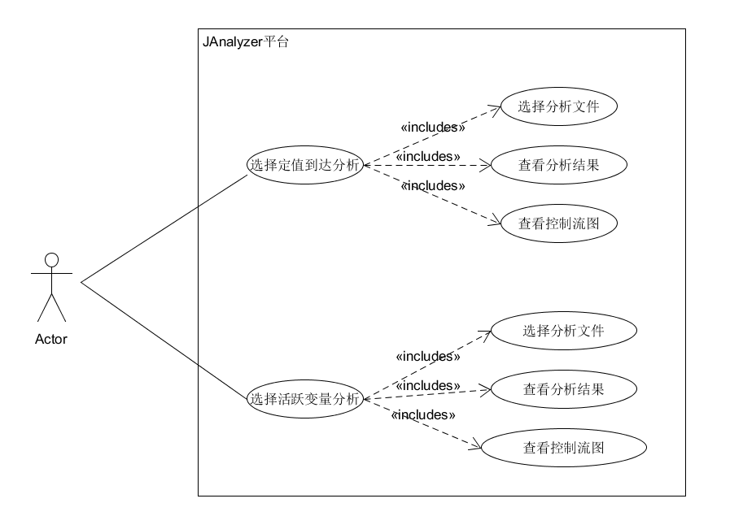
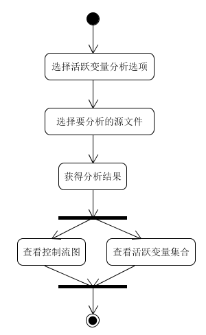
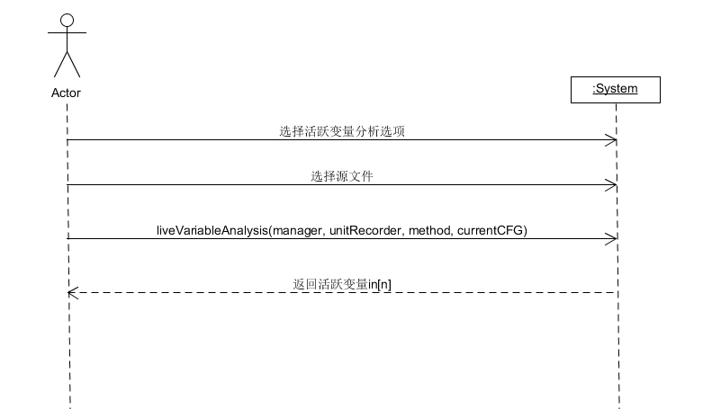
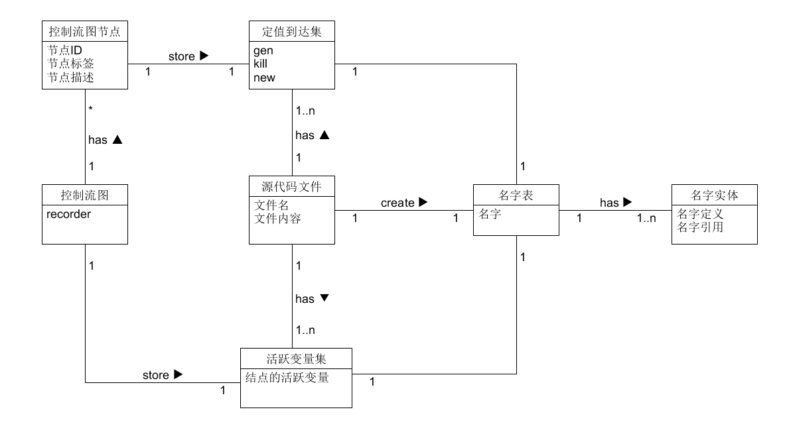
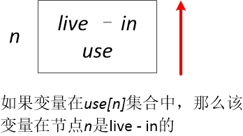
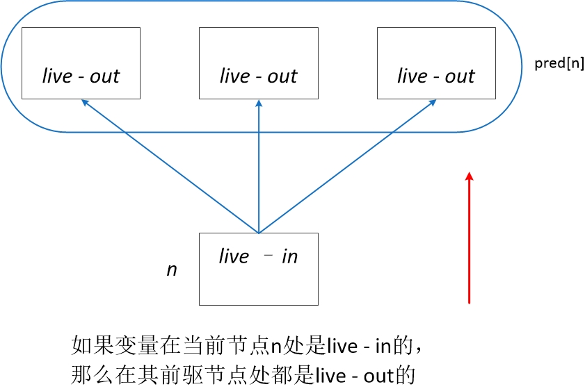
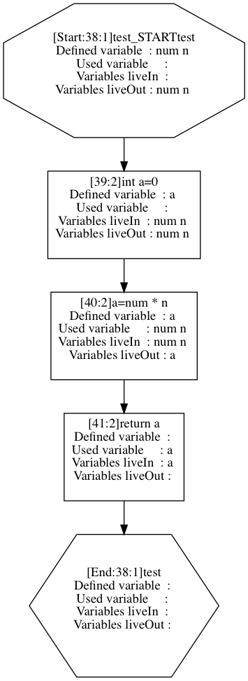
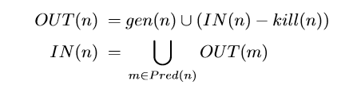
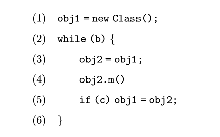
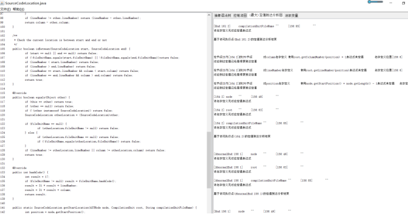

# JAnalyzer活跃变量分析项目设计说明书
---
撰写人：张毅超  补充：杨茂林、张书博

## 1. 引言

### 1.1 编写目的

- 本文档的目的是详细介绍基于java语言源代码理解与分析平台JAnalyzer进行的活跃变量分析的设计说明。包括项目的需求分析、总体设计、详细设计、测试设计等。
- 本文档用于分析清楚代码需求，方便后续分工和完成项目。开发者可以根据此设计文档进行编程上的自我调整，也可在后期测试和维护阶段依旧参考此说明书。不断找出设计中的不足，不断对此文档进行填充和完善


### 1.2 项目背景

- 本项目为中山大学高级实训（软件测试方向）的制品。并非从零开发，而是在已有的Java语言源代码理解与分析平台——JAnalyzer的基础上，对其功能进行补充和添加。目前已有一份开发文档以及源码，在学习和理解二者的基础上，进行再开发。
- JAnalyzer有完成抽象语法树生成、名字表生成和软件结构提取这三个基础构件。这三个功能是对源代码做静态分析的基础，任何对软件源代码的理解和分析都需要在生成抽象语法树和名字表的基础上，基于软件的结构完成。


### 1.3 参考资料

[1]陆卫东,金成植.基于活跃变量分析的流图语言的部分求值器[J].软件学报,1997(01):30-36. <br><br>
[2]JAnalyzer基础构建开发文档 <br><br>
[3]JAnalyzer源码 <br><br>
[3]网上相关博客和论坛 <br><br>
[4]维基百科 <br><br>


## 2. 总体设计

### **2.1 目标**

基于JAnalyzer平台补充定值到达分析、实现活跃变量分析，并实现可视化界面（包括装入待分析的Java源代码，启动分析，以合适的可视化图表展示分析结果）。

### 2.2 需求规格说明

请参考[需求规格说明书](./需求规格说明书.md )。

### 2.3 软件结构

用例图：



活动图：



系统顺序图：



领域模型：




## 3. 详细设计

### 3.1.活跃变量的定义(definition of live variable)

> Live variable: A variable **v** is live at point **p** if the value of **v** is used along some path in the flow graph starting at **p**. For variable **v** and program point **p**,  if the value of **v** at **p** can still be used along some path starting at **p** we say **v** is live at **p**.

活跃变量是针对程序中出现的变量(variable)而言的。如果说一个变量*b*在某个程序点(program point)*p*活跃(live)，意味着变量*b*在程序点*p*的值在*p*以后的语句中会被用到；如果说变量在一个程序点不活跃(dead)，就代表它的值在该程序点以后不会再被用到。换句话说，如果一个变量的值已经不在被用到，那用于存储这个变量的寄存器就可以用于存储其他变量。因此，进行活跃变量分析的原因是为了进行寄存器优化。

### 3.2.如何分析活跃变量(how to calculate live variable)

从活跃变量的定义中我们可以发现，活跃变量分析主要是通过查找当前程序点以后会不会使用该变量，因此活跃变量分析属于后向数据流分析(backward dataflow analysis)，我们从该节点以后的程序节点进行当前节点的活跃变量分析。首先我们需要找到每个程序点中对应的以下集合

```c++
pred[n]：当前节点的前驱节点
// 对一个程序节点来说
// 如果一个变量在该节点活跃
// 那这个变量在他的前驱节点也应该活跃
succ[n]：当前节点的后继节点
// 对一个程序节点来说
// 在它后继节点中活跃的变量在该节点同样应该活跃
// 所以需要知道它有哪些后继节点
def[n]：在当前节点定义的变量
// 对一个程序节点来说
// 如果它定义了一个变量，或者对一个变量进行了赋值
// 那这个变量在它的前驱节点就不再活跃
use[n]：在当前节点使用的变量
// 对一个程序节点来说
// 如果它使用了一个变量
// 那这个变量在它的前驱节点就应该是活跃的
```

从上述分析来看，我们可以发现我们是通过分析当前节点定义以及使用的变量来得到之前节点的活跃变量情况。但是，对于一个程序节点来说，它的前驱的活跃变量集合和它的后继的活跃变量集合是不同的(取决于当前节点定义以及使用的变量)，因此我们定义两个集合，一个是livein的集合，另一个是liveout的集合。我们可以将live-in和live-out理解为具有穿越性，live-in通过live-out和当前节点的表达式进行计算。通过下面几张图我们可以发现，通过后向数据流分析(从结束语句开始分析，一步一步往上)，我们可以计算出每个程序节点live-in和live-out的值。

 <br><br>
 <br><br>
 <br><br>

具体数据流方程如下所示：

```c++
in[n] = use[n] U (out[n] - def[n])
out[n] = U in[s] (s是n的所有后继)
```

程序伪代码如下：

```java
for each node n in CFG
    in[n] = {};
    out[n] = {};
do {
    for each node n in CFG (reverse order) {
        in’[n] = in[n];
        out’[n] = out[n];
        out[n] = U in[s] (s是n的所有后继);
        in[n] = use[n] U (out[n] - def[n]);
    }
} until (in’[n] == in[n] && out’[n] == out[n]) // 收敛
```

### 3.3.如何实现活跃变量分析(the implement of live variable)

因为是在平台**JAnalyzer**上进行活跃变量分析，所以首先需要按照**JAnalyzer**进行数据流分析的一般步骤进行开发。

> (1)首先，需要为存储在可执行点的数据流分析中间结果定义一个接口，这个接口继承IFlowInfoRecorder，并根据要存储的数据流分析中间结果定义相应的读写结果信息的方法;

> (2)其次，需要为存储在可执行点的数据流分析中间结果定义一个类实现(1)中所说的接口，这 个类的对象示例真正存放数据流分析(中间)结果

> (3)最后，我们为这种数据流分析功能实现一个分析器类，这个类利用(2)中所定义的数据流分 析中间结果类在控制流图的可执行点存放中间结果，并对数据流分析方程进行迭代求解，求解最终 的结果存储在每个可执行点的recorder字段(所指向的对象实例)，供其他程序使用。

* 因此，定义了以下4个类用以数据流分析。

```java
ILiveVariableRecorder.java
// 用于存储中间结果的接口类
LiveVariableRecorder.java
// 用于存储中间结果的类
LiveVariableDefinition.java
// 活跃变量的定义
LiveVariableAnalyzer.java
// 进行活跃变量分析的分析器
```

* 对于存储中间结果的recorder来说，我们需要定义对于中间结果进行读取的操作，因此其定义如下

```java
// ILiveVariableRecorder.java

public interface ILiveVariableRecorder extends IFlowInfoRecorder {
    public boolean addUseVariable(LiveVariableDefinition variable);
    public boolean addDefVariable(LiveVariableDefinition variable);
    public boolean addLiveInVariable(LiveVariableDefinition variable);
    public boolean addLiveOutVariable(LiveVariableDefinition variable);

    public List<LiveVariableDefinition> getUseVariableList();
    public List<LiveVariableDefinition> getDefVariableList();
    public List<LiveVariableDefinition> getLiveInVariableList();
    public List<LiveVariableDefinition> getLiveOutVariableList();

    public boolean removeLiveInVariable(LiveVariableDefinition variable);
    public boolean removeLiveOutVariable(LiveVariableDefinition variable);
    public boolean contains(List<LiveVariableDefinition> list, LiveVariableDefinition variableDefinition);
    public void setLiveInEmpty();
    public void setLiveOutEmpty();
}
```

* 在真正的recorder里面，定义了4个链表用于存储中间结果，然后实现了接口类中所定义的函数。

```java
// LiveVariableRecorder.java

public class LiveVariableRecorder implements ILiveVariableRecorder {
    protected List<LiveVariableDefinition> UseVariableList = null;
    protected List<LiveVariableDefinition> DefVariableList = null;
    protected List<LiveVariableDefinition> LiveInVariableList = null;
    protected List<LiveVariableDefinition> LiveOutVariableList = null;

    // override the function in interface class
}
```

* 除此之外，我们需要找到活跃变量应该如何定义。对于一个变量来说，我们不仅需要知道它的作用域、它的变量名、它的值以外，我们还需要知道它在哪里被定义，因此，我们需要通过三个属性定义一个活跃变量。

```java
// LiveVariableDefinition.java

public class LiveVariableDefinition {
    protected NameReference reference = null;
    protected NameDefinition definition = null;
    protected ExecutionPoint node = null;

    public LiveVariableDefinition(NameReference reference, NameDefinition definition, ExecutionPoint node) {
        this.reference = reference;
        this.definition = definition;
        this.node = node;
    }

    // some method in this class
}
```

* 进行活跃变量分析，最重要的部分就在于分析器应该如何写。在**JAnalyzer**中，首先要生成对应源代码的控制流图，然后在控制流图中进行数据流分析。因此，可以将活跃变量分析的步骤分为以下几步

```java
// LiveVariableAnalyzer.java

public class LiveVariableAnalyzer {
    public static ControlFlowGraph create(NameTableManager nameTable, MethodDefinition method) {
        CompilationUnitScope unitScope = nameTable.getEnclosingCompilationUnitScope(method);
        if (unitScope == null) return null;
        String sourceFileName = unitScope.getUnitName();
        CompilationUnit astRoot = nameTable.getSouceCodeFileSet().findSourceCodeFileASTRootByFileUnitName(sourceFileName);
        if (astRoot == null) return null;
        CompilationUnitRecorder unitRecorder = new CompilationUnitRecorder(sourceFileName, astRoot);

        // Create a ControFlowGraph object
        ControlFlowGraph currentCFG = CFGCreator.create(nameTable, unitRecorder, method);
        if (currentCFG == null) return null;
            setLiveVariableRecorder(currentCFG);
        // live variable analysis
        liveVariableAnalysis(nameTable, unitRecorder, method, currentCFG);
        return currentCFG;
    }

    public static void setLiveVariableRecorder(ControlFlowGraph currentCFG) {
        // 给每个控制流图节点定义新的recorder
    }

    static void initializeDefAndUseVariableInAllNodes(NameTableManager manager, CompilationUnitRecorder unitRecorder, MethodDefinition method, ControlFlowGraph currentCFG) {
        // 找到每个程序节点中定义以及使用的变量
    }

    public static void liveVariableAnalysis(NameTableManager manager, CompilationUnitRecorder unitRecorder, MethodDefinition method, ControlFlowGraph currentCFG) {
        // 进行活跃变量分析
    }
```

对于活跃变量来说大的步骤已经完成了。现在就看应该如何实现这些函数。

* 对于def[]和use[]的求解，最重要的是要分情况加以计算，对于`java`中的表达式，可以分为以下几种情况，每种情况中所对应的def[]和use[]都是不同的

```java
// static void initializeDefAndUseVariableInAllNodes() {}

if (nodeType == ASSIGNMENT) {
} else if (nodeType == METHOD_INVOCATION) {
} else if (nodeType == RETURN_STATEMENT) {
} else if (nodeType == ENHANCED_FOR_STATEMENT) {
} else if (nodeType == FOR_STATEMENT) {
} else if (nodeType == IF_STATEMENT) {
} else if (nodeType == PREFIX_EXPRESSION) {
} else if (nodeType == POSTIX_EXPRESSION) {
} else if (nodeType == PREFIX_EXPRESSION) {
} else if (nodeType == VARIABLE_DECLARATION_EXPRESSION) {
} else if (nodeType == VARIABLE_DECLARATION_FRAGMENT) {
} else if (nodeType == VARIABLE_DECLARATION_STATEMENT) {
}
```

* 在找到def[]和use[]集合后，进行活跃变量分析就比较简单了，具体分析代码如下

```java
// static void liveVariableAnalysis() {}

public static void liveVariableAnalysis(NameTableManager manager, CompilationUnitRecorder unitRecorder, MethodDefinition method, ControlFlowGraph currentCFG) {
    // get Def[n] and Use[n] for for all nodes
    initializeDefAndUseVariableInAllNodes(manager, unitRecorder, method, currentCFG);
    // compute LiveIn[n] and LiveOut[n]
    boolean hasChanged = true;
        while (hasChanged) {
            hasChanged = false;
            List<GraphNode> graphNodes = currentCFG.getAllNodes();
            for (GraphNode graphNode : graphNodes) {
                ExecutionPoint currentNode = (ExecutionPoint)graphNode;
                ILiveVariableRecorder currentRecorder = (ILiveVariableRecorder)currentNode.getFlowInfoRecorder();

                // LiveInList is in[n]
                // LiveInList_ is in[n]'
                // first set them equal
                // if in[n] and in[n]' is different
                // need iterate again
                List<LiveVariableDefinition> LiveInList = currentRecorder.getLiveInVariableList();
                List<LiveVariableDefinition> LiveInList_ = new ArrayList<LiveVariableDefinition>();
                for (LiveVariableDefinition definition : LiveInList) {
                    LiveInList_.add(definition);
                }

                currentRecorder.setLiveInEmpty();
                currentRecorder.setLiveOutEmpty();

                List<LiveVariableDefinition> UseList = currentRecorder.getUseVariableList();
                List<LiveVariableDefinition> DefList = currentRecorder.getDefVariableList();

                // out[n] = U in[s]
                List<GraphNode> successorsOfNode = currentCFG.adjacentFromNode(graphNode);
                for (GraphNode adjacentFromNode : successorsOfNode) {
                    if (adjacentFromNode instanceof ExecutionPoint) {
                        ExecutionPoint successorOfNode = (ExecutionPoint)adjacentFromNode;
                        ILiveVariableRecorder successorRecorder = (ILiveVariableRecorder)successorOfNode.getFlowInfoRecorder();

                        List<LiveVariableDefinition> successorLiveInList = successorRecorder.getLiveInVariableList();
                        for (LiveVariableDefinition variable : successorLiveInList) {
                            currentRecorder.addLiveOutVariable(variable);
                        }
                    }
                }

                // tempList is out[n]
                // in[n] = (out[n] - Def[n]) U Use[n]
                List<LiveVariableDefinition> tempList = currentRecorder.getLiveOutVariableList();
                for (LiveVariableDefinition temp : tempList) {
                    currentRecorder.addLiveInVariable(temp);
                }

                for (LiveVariableDefinition Def : DefList) {
                    currentRecorder.removeLiveInVariable(Def);
                }

                for (LiveVariableDefinition Use : UseList) {
                    currentRecorder.addLiveInVariable(Use);
                }

                // if in[n] == in[n]'
                for (LiveVariableDefinition definition : LiveInList) {
                    if (!currentRecorder.contains(LiveInList_, definition)) {
                    hasChanged = true;
                    }
                }
            }
        }
    }
```

### 3.4.如何进行将分析结果可视化(how to implement visualization)

可视化的意义在于能够很清楚的知道：对于每个程序点，它有哪些live-in的变量，有哪些是live-out的变量。因此，一个简单的思路是将recorder中存储的信息保存到一个`.dot`文件中，使用*GraphViz*就能够得到可视化的控制流图，其中包含了数据流分析得到的结果。

在*JAnalyzer*平台中已经实现了这个功能(simpleWriteToFile)，因此，我们需要做的就是将数据流分析的结果输出。

```java
// writeLiveVariableToFile()

public void writeLiveVariablesToFile(PrintWriter output) throws IOException {
    final int MAX_LABEL_LEN = 300;

    String graphId = GraphUtil.getLegalToken(getId());
    output.println("digraph " + graphId + " {");
    for (GraphNode currentNode : nodes) {
        if (nodes instanceof ExecutionPoint) {
        System.out.println(((ExecutionPoint) currentNode).getLabel());
    }
    CFGNode node = (CFGNode)currentNode;
    String label = node.getDescription();
    if (label == null || label.trim().equals("")) label = node.getLabel();
    String nodeId = "node" + GraphUtil.getLegalToken(node.getId());
    String nodeShape = "box";
    // Set the special id and shape for start, normal and abnormal end, predicate and other virtual nodes
    if (node.isAbnormalEnd()) {
        nodeId = methodName + "_ABNORMAL_END";
    label = nodeId + label;
    nodeShape = "tripleoctagon";
    } else if (node.isNormalEnd()) {
        nodeId = methodName + "_END";
    label = nodeId + label;
    nodeShape = "octagon";
    } else if (node.isStart()) {
        nodeId = methodName + "_START";
    label = nodeId + label;
    nodeShape = "octagon";
    } else if (node.isVirtual()) {
        nodeShape = "hexagon";
    } else if (node.isPredicate()) {
        nodeShape = "diamond";
    }
    if (node instanceof ExecutionPoint) {
        ExecutionPoint graphNode = (ExecutionPoint)node;
    label += graphNode.getLabel();
    }
    if (label.length() > MAX_LABEL_LEN) {
        label = label.substring(0, MAX_LABEL_LEN) + "...";
    }
    label = label.replace('\"', '\'');
    label = label.replace("\r", "");
    output.println("    " + nodeId + "[label = \"[" + node.getId() + "]" + label + "\", shape = " + nodeShape + "]");
    }
    for (GraphEdge edge : edges) {
        String label = edge.getLabel();
    CFGNode startNode = (CFGNode)edge.getStartNode();
    CFGNode endNode = (CFGNode)edge.getEndNode();
    String startNodeId = "node" + GraphUtil.getLegalToken(startNode.getId());
    String endNodeId = "node" + GraphUtil.getLegalToken(endNode.getId());
    // Set special id for start, normal and abnormal end nodes. These setting must be consistent with
    // the setting in the above loop for the nodes of the CFG
    if (startNode.isAbnormalEnd()) {
        startNodeId = methodName + "_ABNORMAL_END";
    } else if (startNode.isNormalEnd()) {
        startNodeId = methodName + "_END";
    } else if (startNode.isStart()) {
        startNodeId = methodName + "_START";
    }
    if (endNode.isAbnormalEnd()) {
        endNodeId = methodName + "_ABNORMAL_END";
    } else if (endNode.isNormalEnd()) {
        endNodeId = methodName + "_END";
    } else if (endNode.isStart()) {
        endNodeId = methodName + "_START";
    }

    if (label != null) {
        output.println("    " + startNodeId + "->" + endNodeId + "[label = \"" + label + "\"]");
    } else {
        output.println("    " + startNodeId + "->" + endNodeId);
    }
    }

    output.println("}");
    output.println();
    output.flush();
    }
```

将进行活跃变量分析过后生成的dot文件在GraphViz中打开就能获得分析得到的可视化结果。

最后的输出结果如下图所示：


### 3.5.活跃变量分析的应用(the application of live variable)

对于我们得到的活跃变量分析的结果，我们应该怎么应用呢？对于以下程序语句

```java
p1 : a = b + c
p2 : c = d
// end of program
```

通过活跃变量分析，我们可以得到:变量a在p1以后不再被用到，这时候我们再用一个寄存器保存它的值就是浪费，我们可以用这个寄存器保存其他变量的值。

从这个例子我们可以发现活跃变量分析对于寄存器的分配有很大的作用。

### 3.6.定值到达分析的定义
对于一个方法中的名字引用，我们需要静态分析它可能的值，或者更准确地说，在某个源代码位置的名字引用，当程序的控制流到达这个点时，这个名字引用所绑定的名字定义可能在此前哪些地方被赋值，这些赋值在数据流分析称为一个名字定义（即局部变量、方法参数和字段）的定值(defined value)。给定某个源代码位置处的名字引用，分析通过控制流能到达该源代码位置处对该名字引用所绑定（引用）的名字定义的可能定值，在数据流分析中称为到达定值(reaching definitions)分析。


### 3.7.定值到达分析的公式原理

控制流离开节点n的到达定值列表OUT(n)等于进入该节点的到达定值列表删除该节点的杀死定值列表再并上该节点的生成定值列表。而进入该节点n的到达定值列表IN(n)等于n的所有前驱节点m的OUT(m)的并，这里Pred(n)给出在控制流图中n的所有前驱节点m，即m有有向边到n。 实际实现时，我们可将OUT(n)看做节点n的所有到达定值列表。<br><br>

如下图所示：<br>



### 3.8.定值到达分析的实现思路
首先，根据文件路径来获得该文件的对应名字表管理器:

```java
// NameTableManager.java

public static NameTableManager createNameTableManager(String projectRootPath, PrintWriter errorReportWriter, String[] externalLibraryHeadFileArray) {
		SourceCodeFileSet parser = new SourceCodeFileSet(projectRootPath);
		NameTableCreator creator = new NameTableCreator(parser);

		NameTableManager manager = creator.createNameTableManager(errorReportWriter, externalLibraryHeadFileArray);
		if (creator.hasError()) {
			errorReportWriter.println("There are " + creator.getErrorUnitNumber() + " error unit files:");
			creator.printErrorUnitList(errorReportWriter);
			errorReportWriter.println();
		}
		return manager;
	}
```

<br>
然后根据名字表管理器获取该文件下的方法定义，并根据方法定义和名字表管理器得到控制流图:

```java
// ReachNameAnalyzer.java

public static ControlFlowGraph create(NameTableManager nameTable, MethodDefinition method) {
		CompilationUnitScope unitScope = nameTable.getEnclosingCompilationUnitScope(method);
		if (unitScope == null) return null;
		String sourceFileName = unitScope.getUnitName();
		CompilationUnit astRoot = nameTable.getSouceCodeFileSet().findSourceCodeFileASTRootByFileUnitName(sourceFileName);
		if (astRoot == null) return null;
		CompilationUnitRecorder unitRecorder = new CompilationUnitRecorder(sourceFileName, astRoot);
		
		// Create a ControFlowGraph object
		ControlFlowGraph currentCFG = CFGCreator.create(nameTable, unitRecorder, method);
		if (currentCFG == null) return null;
		
		setReachNameRecorder(currentCFG);
		reachNameAnalysis(nameTable, unitRecorder, method, currentCFG);
		return currentCFG;
	}
```


然后获取控制流图中的所有节点，对所有节点进行一次遍历，如果该节点是可执行点，就可以进行定值到达分析:

```java
// TestCFGCreator.java

for (NameDefinition definition : methodList) {
			MethodDefinition method = (MethodDefinition)definition;
			//ControlFlowGraph cfg = ReachNameAndDominateNodeAnalyzer.create(tableManager, method);
			ControlFlowGraph cfg = ReachNameAnalyzer.create(tableManager, method);
			if(cfg == null) continue;
			//if(cfg.getAllNodes() == null) continue;
			
			List<GraphNode> nodeList = cfg.getAllNodes();
			
			if(nodeList.isEmpty()) continue;
	
			System.out.println("Before write execution point " + nodeList.size() + " nodes!");
			buffer.append("Before write execution point " + nodeList.size() + " nodes!"+"\n");
			
			totalCFGS += nodeList.size();
			
			for (GraphNode graphNode : nodeList) {
				if (graphNode instanceof ExecutionPoint) {
					ExecutionPoint node = (ExecutionPoint)graphNode;
					ReachNameRecorder recorder = (ReachNameRecorder)node.getFlowInfoRecorder();
					List<ReachNameDefinition> definedNameList = recorder.getReachNameList();
					for (ReachNameDefinition definedName : definedNameList) {
						NameDefinition name = definedName.getName();
						NameReference value = definedName.getValue();
						if (definedName.getValue() != null) {
							//output.println("在节点ID为" + "[" + graphNode.getId() + "]" + "的CFG节点\t" + "对" + name.getSimpleName() + "名字定义"+ "\t" + "使用" + value.toSimpleString() + "表达式来定值" + "\t[" + name.getLocation() + "]\t[" + value.getLocation() + "]");
							buffer.append("在节点ID为" + "[" + graphNode.getId() + "]" + "的CFG节点\t" + "对" + name.getSimpleName() + "名字定义"+ "\t" + "使用" + value.toSimpleString() + "表达式来定值" + "\t" + "名字定义位置" + "[" + name.getLocation() + "]" + "\t"+ "表达式位置" + "["  + value.getLocation() + "]" +"\n");
						} else {
							//output.println("[" + graphNode.getId() + "]\t" + definedName.getName().getSimpleName() + "\t~~\t[" + name.getLocation() + "]\t~~");
							buffer.append("[" + graphNode.getId() + "]\t" + definedName.getName().getSimpleName() + "\t~~\t[" + name.getLocation() + "]\t~~"+"\n");
							buffer.append("该名字定义无对应定值表达式\n\n");
						}
						//进行根源定值到达分析
						if(definedName.getValue() != null) {
							//buffer.append("以下是对上述到达定值进行根源到达定值分析，若为空说明对应到达定值已经是根源到达定值\n\n");
							int countRoot = 0;
							List<ReachNameDefinition> exploredNameList = ReachNameAnalyzer.getRootReachNameDefinitionList(cfg, node, value);
							for (ReachNameDefinition definedNameNew : exploredNameList) {
								NameDefinition nameNew = definedNameNew.getName();
								NameReference valueNew = definedNameNew.getValue();
								if(definedNameNew.getValue() != null) {
									countRoot++;
									buffer.append("其根源到达定值为:\n");
									buffer.append("名字定义:"+nameNew.getSimpleName()+"\t"+"定值表达式:"+valueNew.toSimpleString()+"\t"+"名字定义位置为:"+"["+nameNew.getLocation()+"]"+"\t"+"表达式位置为:"+"["+valueNew.getLocation()+"]"+"\n"+"\n");
								} else {
									buffer.append("根源到达定值的名字定义无对应表达式\n\n");
									//buffer.append("[" + graphNode.getId() + "]\t" + definedName.getName().getSimpleName() + "\t~~\t[" + name.getLocation() + "]\t~~"+"\n"+"\n");
								}
							}
							if(countRoot == 0) {
								buffer.append("对应到达定值已经是根源到达定值\n\n");
							}
						
						}
						
					}
					buffer.append("基于该可执行点" + "("+ graphNode.getId() +")" +"的定值到达分析结束" + "\n" + "\n" + "\n" + "\n");
				} else {
					output.println(graphNode.getId() + "\t~~\t~~\t~~\t~~");
					System.out.println("Found none execution point with defined name node!");
					buffer.append("Found none execution point with defined name node!"+"\n");
				}
			}
			
			
			//output.println();
			//output.println();
			
			buffer.append("\n");
			try {
				cfg.simplyWriteToDotFileFixedValue(output);
			} catch (Exception exc) {
				exc.printStackTrace();
			}
			
			nodeList.clear(); //清除 以便下一次循环重新加载nodeList
		}
```

### 3.9.根源定值到达分析的实现思路
在实现普通的定值到达分析的同时，也实现根源定值到达分析。

以下为根源到达分析的定义及举例：

对于节点n处的对象表达式objexp的一个到达定值(m,v,exp)，这里v是objexp所绑定的名字定 义，在节点m处使用exp对v进行了定值。我们考虑exp的两种简单情形： (1) 用于定值v的表达式exp本身绑定到局部变量或参数u，则认为节点m处的每个形如(k,u,exp0)的 到达定值可传播给到达定值(m,v,exp)，记为(k,u,exp0)→(m,v,exp)； (2) 用于定值v的表达式exp是类型转换表达式(type)exp0，而exp0本身绑定到局部变量或参数u， 则也认为节点m处每个形如(k,u,exp00)的到达定值可传播给定值(m,v,exp)，记为(k,u,exp00) → (m,v,exp)。 从而→给出了到达定值三元组之间的传播关系，记→∗为这个关系的传递闭包，则节点n处的 对象表达式objexp的一个根源到达定值(root reaching definitions)(m,v,exp)满足：存在(k,u,exp0)∈ RD(n,exp)，使得(m,v,exp)→∗ (k,u,exp0)，且不再存在定值(l,w,exp00)使得(l,w,exp00)→(m,v,exp)， 也即exp不再绑定到局部变量或参数，也不是类型换表达式(type)exp000，其中exp000绑定到局部变量 或参数。记RRD(n,exp)为节点n处的对象表达式exp的所有根源到达定值列表。 

上面这个定义看起来有点复杂，但实际上使用算法实现求节点n处的对象表达式exp的所有根源 到达定值列表比较简单，只要对RD(n,exp)中的每个到达定值(m,v,exp0)，基于exp的形式针对上面 两种简单情形不断迭代直到最后得到的定值(k,u,exp00)中的表达式exp00不绑定到局部变量或参数， 也不是符合要求的类型转换表达式即可。但这个实现要注意避免死循环的情况，例如对于下面的程 序片段，其中obj1, obj2是对象引用，b, c是条件表达式。按照定义代码行（控制流图节点）(4)处的 对象引用obj2的到达定值是：<br><br>
RD((4),obj2) ={h(3),obj2,obj1i}

例子代码：<br>



从而根据上述定义节点(4)处对象引用obj2的根源定值只有<(1),obj1,new Class()>。 

类ReachNameAnalyzer的静态方法getRootReachNameDefinitionList()给返回给定控制流图 的给定可执行点中某个名字引用的根源到达定值列表（其形式参数与方法getReachNameDefinitionList()相同），当然其前提也是该控制流图的节点中存放了到达定值信息。实际上，这个方法是调用静态方法exploreRootReachNameDefinitionList()按照上面所说的过程探索一个名字引用的根源到达定值。方法getRootReachNameDefinitionList()实际上是给出一个探索的起点，而方法exploreRootReachNameDefinitionList()则会利用方法extractPropagableReference()提取定值中用于赋值的表达式中的可能进行定值传播的简单名字引用表达式或类型转换表达式，从而递归地调用方法exploreRootReachNameDefinitionList()自己进行根源到达定值的探索，在探索过程中按照上面所说的策略避免陷入死循环。<br>

getRootReachNameDefinitionList()方法与exploreRootReachNameDefinitionList()方法如下所示：


```java
// ReachNameAnalyzer.java

public static List<ReachNameDefinition> getRootReachNameDefinitionList(ControlFlowGraph currentCFG, ExecutionPoint node, NameReference reference) {
		List<ReachNameDefinition> exploredNameList = new ArrayList<ReachNameDefinition>();

		return exploreRootReachNameDefinitionList(exploredNameList, node, reference);
	}
```

```java
// ReachNameAnalyzer.java

public static List<ReachNameDefinition> exploreRootReachNameDefinitionList(List<ReachNameDefinition> exploredNameList, ExecutionPoint node, NameReference reference) {
		List<ReachNameDefinition> result = new ArrayList<ReachNameDefinition>();
		
		NameDefinition definition = extractLeftValueInReference(reference);
		if (definition == null) return result;
		
		IReachNameRecorder recorder = (IReachNameRecorder)node.getFlowInfoRecorder();
		List<ReachNameDefinition> definedNameList = recorder.getReachNameList();
		for (ReachNameDefinition definedName : definedNameList) {
			if (exploredNameList.contains(definedName)) continue;
			
			if (definedName.getName() == definition) {
				exploredNameList.add(definedName);
				
				NameReference valueReference = definedName.getValue();
					
				NameReference propagatedReference = extractPropagableReference(valueReference);
				if (propagatedReference != null) {
					List<ReachNameDefinition> propagatedReachNameList = exploreRootReachNameDefinitionList(exploredNameList, definedName.getNode(), propagatedReference);
					result.addAll(propagatedReachNameList);
				} else result.add(definedName);
			}
		}
		return result;
	}
```

### 3.10.结果显示
定值到达分析的结果显示与可视化方法步骤与活跃变量分析类似不再赘述，这里直接展示结果图：
定值到达分析的文本分析如下图：<br><br>


定值到达分析的可视化结果如下图：(可打开源文件放大看详细内容: ./assets/reachResult2.png)<br><br>


## 4. 小组分工(测试详细分工在测试报告中)

| 学号 | 姓名 | 职务 | 分工 |
| :-: | :-: | :-: | :-: | :-: |
| 15331405 | 张毅超 | 组长 | 管理小组进度、撰写项目设计说明书、需求分析说明书 |
| 15331400 | 张书博 | 组员 | 完成定值到达分析程序部分、撰写该部分用户手册 |
| 15331362 | 杨茂林 | 组员 | 完成活跃变量分析程序部分、撰写该部分用户手册 |
| 15331417 | 赵洋 | 组员 | 对活跃变量分析部分进行测试、撰写测试计划、测试报告 |
| 15331399 | 张睿 | 组员 | 对定值到达分析程序部分进行测试 |
| 15331058 | 邓清方 | 组员 | 协助部分代码工作、测试工作 |


## 5. 测试

[软件测试计划.pdf](./软件测试计划.pdf) <br><br>
[软件测试报告.pdf](./测试测试报告.pdf) <br><br>

